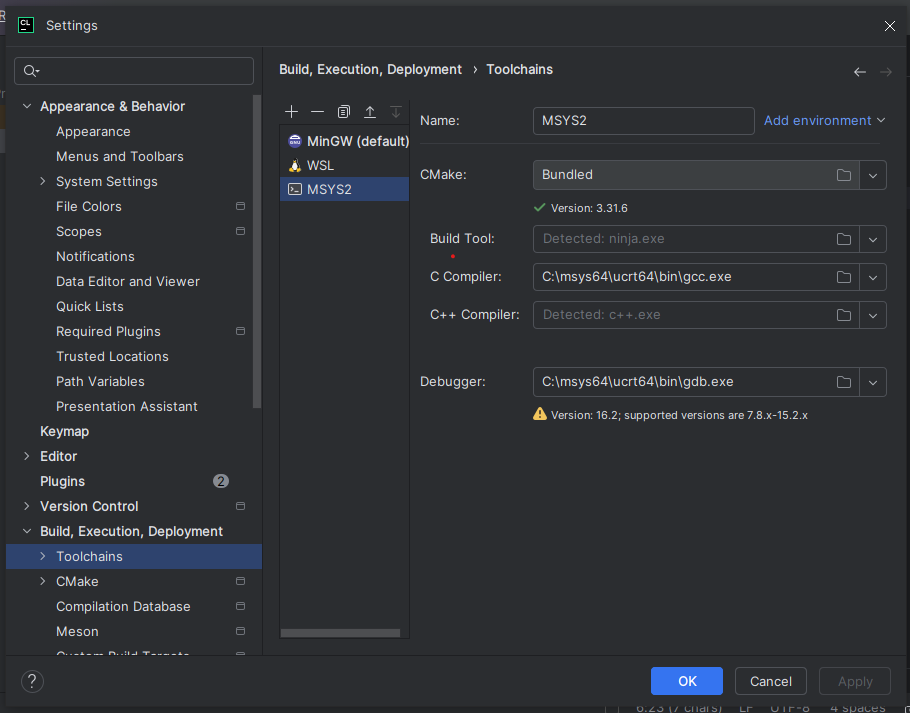
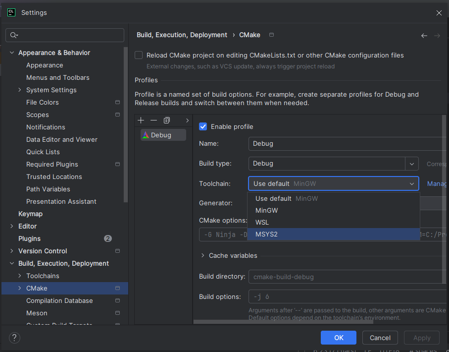
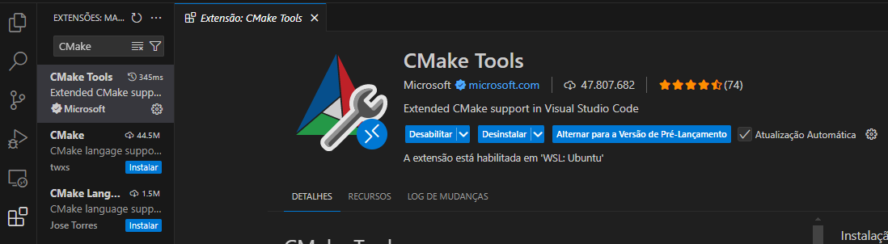

# 1 - Instalação do GTK + CMake + Glade no Windows

A instalação da biblioteca GTK no Windows pode ser feita através do [MSYS2](#msys2) ou através do [WSL](#wsl)

## MSYS2
Esse método permite a compilação de aplicações GTK diretamente para executáveis de Windows. Entretanto, também tende a ser mais complicada por ser necessário fazer a inclusão manual das pastas dos binários no PATH. Além do mais, esse é apenas um sistema de compatibilidade, tendo em vista que a biblioteca GTK foi projetada para funcionar em programas UNIX.

O processo será feito para utilização na IDE CLion, que já possui uma versão do CMake junto de seus arquivos - uma ferramenta essencial para o desenvolvimento futuro.

1. Abra o MSYS2_UCRT64 e digite o seguinte comando  
    ```
    pacman -S mingw-w64-ucrt-x86_64-gtk4 mingw-w64-x86_64-glade mingw-w64-x86_64-cmake mingw-w64-x86_64-ninja
    ```  
   Isso instalará as bibliotecas GTK4, o programa Glade, e o CMake mais o sistema de build Ninja (a instalação do CMake é necessária caso não deseje fazer o projeto dentro de uma IDE).

3. Certifique-se que `C:\msys64\ucrt64\bin`, `C:\msys64\usr\bin` e `C:\msys64\mingw64\bin` estejam no PATH no sistema (pode rever como fazer isso na seção de [Instalação do compilador GCC no Windows](/C/instalacao-c-windows.md))

4. Dentro do seu projeto de executável em C no CLion, abra as configurações (<b>Ctrl+Alt+S</b>), pesquise por <b>Toolchains</b>, adicione uma nova toolchain do tipo System (<b>Alt+Ins</b>, recomendo renomeá-la para MSYS2), e na opção do compilador C, selecione o caminho do gcc (provavelmente será `C:\msys64\ucrt\bin\gcc.exe`).

    Depois, pesquise por <b>CMake</b>, mude a Toolchain para a que acabou de ser criada e clique em <b>Apply</b>.

      
    *Adição da Toolchain do MSYS2*  

      
    *Configuração do CMake*  

## WSL

Através do WSL, é possível um desenvolvimento mais direto com a biblioteca GTK. O único ponto é que talvez seja pedido para que o programa rode em plataforma Windows, mas existe uma ferrameta que compila arquivos em Linux para executáveis de Windows, que será mostrado mais a frente.

O processo será feito através do VSCode.

1. Dentro do terminal do WSL, digite  
    ```
    sudo apt install libgtk-4-dev glade cmake
    ```  
    que instalará a biblioteca GTK4, o programa Glade e o CMake dentro do subsistema.

2. Instale a extensão <b>CMake Tools</b>

      
    *Extensão CMake Tools*

3. No VSCode, abra a pasta do projeto, abra a paleta de comandos (**Ctrl+Shift+P**), digite CMake Start, e siga os passos subsequentes.

## Checando a instalação

1. Coloque esse código em `CMakeLists.txt`

    ```
    cmake_minimum_required(VERSION 3.31)
    project(<COLOQUE O NOME DO PROJETO AQUI> C)

    set(CMAKE_C_STANDARD 11)

    find_package(PkgConfig REQUIRED)
    pkg_check_modules(GTK REQUIRED gtk4)

    add_executable(${PROJECT_NAME} main.c)

    target_link_libraries(${PROJECT_NAME} PRIVATE ${GTK_LIBRARIES})
    target_compile_options(${PROJECT_NAME} PRIVATE ${GTK_CFLAGS})
    ```

2. Agora teste o programa Hello World disponibilizado no [site do GTK](https://www.gtk.org/docs/getting-started/hello-world)
    ```
    #include <gtk/gtk.h>

    static void
    print_hello (GtkWidget *widget,
                gpointer   data)
    {
    g_print ("Hello World\n");
    }

    static void
    activate (GtkApplication *app,
            gpointer        user_data)
    {
    GtkWidget *window;
    GtkWidget *button;

    window = gtk_application_window_new (app);
    gtk_window_set_title (GTK_WINDOW (window), "Hello");
    gtk_window_set_default_size (GTK_WINDOW (window), 200, 200);

    button = gtk_button_new_with_label ("Hello World");
    g_signal_connect (button, "clicked", G_CALLBACK (print_hello), NULL);
    gtk_window_set_child (GTK_WINDOW (window), button);

    gtk_window_present (GTK_WINDOW (window));
    }

    int
    main (int    argc,
        char **argv)
    {
    GtkApplication *app;
    int status;

    app = gtk_application_new ("org.gtk.example", G_APPLICATION_DEFAULT_FLAGS);
    g_signal_connect (app, "activate", G_CALLBACK (activate), NULL);
    status = g_application_run (G_APPLICATION (app), argc, argv);
    g_object_unref (app);

    return status;
    }
    ```
